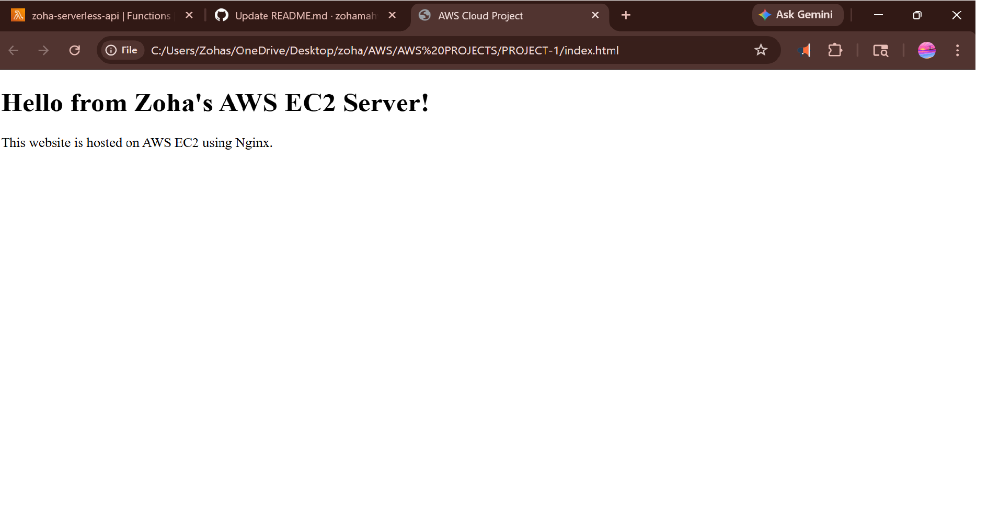

# Aws-Ec2-Nginx-Website-Deployment
This project demonstrates deploying a static website on AWS EC2 using Nginx and Linux.

## Steps performed
- Launched an EC2 instance (Amazon Linux)
- Connected using SSH
- Installed and configured Nginx
- Hosted a custom HTML webpage
- Configured security groups for HTTP access

## Preview

## Tech Used
  - AWS EC2
  - Linux
  - Nginx
  - GitHub
    
